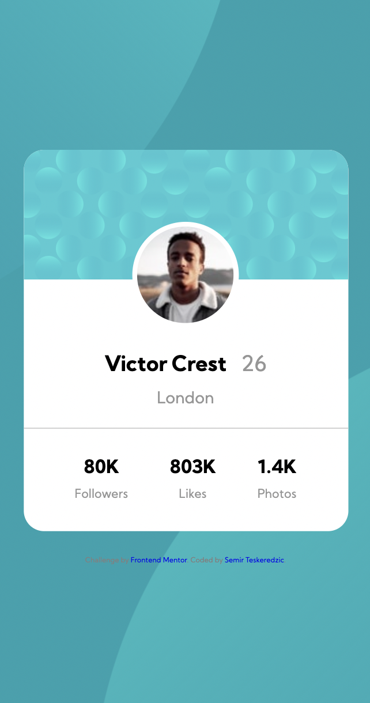

# Frontend Mentor - Profile card component solution

This is a solution to the [Profile card component challenge on Frontend Mentor](https://www.frontendmentor.io/challenges/profile-card-component-cfArpWshJ). Frontend Mentor challenges help you improve your coding skills by building realistic projects. 

## Table of contents

- [Overview](#overview)
  - [The challenge](#the-challenge)
  - [Screenshot](#screenshot)
  - [Links](#links)
- [My process](#my-process)
  - [Built with](#built-with)
- [Author](#author)

## Overview

### The challenge

- Build out the project to the designs provided

### Screenshot

### Links

- Solution URL: [Solution URL](https://www.frontendmentor.io/solutions/profile-card-done-with-html-and-css-GcSmlMSJx)
- Live Site URL: [Live Site URL](https://semirteskeredzic.github.io/profile-card-component/)

## My process

Before starting to code I've created an empty git repository and initialized a git repository inside my project folder, then I set the git remote to the newly created repository.
After that I reviewed design and wrote down HTML structure of elements along with the class names using double and single dash notation. I've created a new preparation branch and went on implementing HTML structure along with global imports of fonts and stylesheets. I've pushed the code and merged it to main branch. I went from mobile view and populated all HTML elements and styled them using CSS. I've done mobile view first and then used media query to style it on bigger viewports.

### Built with

- Semantic HTML5 markup
- CSS custom properties
- Flexbox
- Mobile-first workflow

## Author

- Github - [Semir Teskeredzic](https://github.com/semirteskeredzic)
- Frontend Mentor - [@semirteskeredzic](https://www.frontendmentor.io/profile/semirteskeredzic)
- Twitter - [@dofedome](https://www.twitter.com/dofedome)
